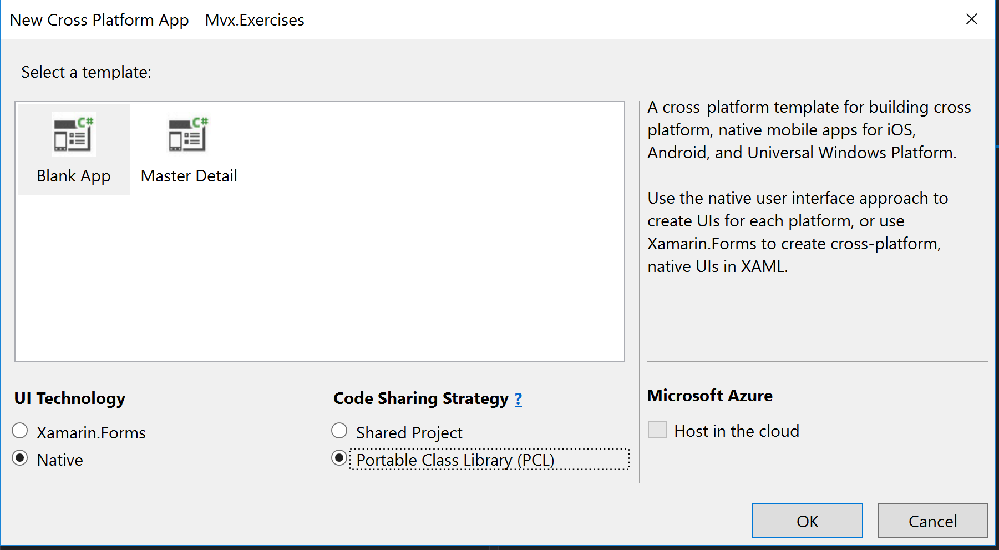

# Aufgabe Day 5 Mvvm mit Mvvm Cross

## Aufgabe 1: Projekt initialisieren 10'min

1. File => New => C# => Crossplattform => Nativ or Forms App

2. Native + PCL
3. Name "Mvx.Exercises"
4. Für alle 3 projekte die nuget referenzen hinzufügen
    - MvvmCross Version 4.4
5. Im Shared Projekt (PCL)
    - Erstelle eine Klasse 'App'
    
     `public class App : MvxApplication`
    - Erstelle eine Klasse 'AppStart'
    
    `public class AppStart : MvxNavigatingObject, IMvxAppStart`
    - Erstelle einen Folder `ViewModels`
    - Erstelle darin eine Klasse 'MainViewModel'
    
     `public class MainViewModel : MvxViewModel`

6. Im Android Projekt
    - Lösche die `MainActivity`
    - Erstelle einen Folder `Views`
    - Erstelle die Klasse 'MainActivity'

`
    [Activity(Label = "Students App", MainLauncher = true)]
    public class MainActivity : MvxActivity<MainViewModel>
    `

7. Erstelle in der PCL einen Ordner `Models`

8. Kopiere die zur Verfügung gestellten Klassen [Model Klassen](templates/models) in die PCL Assembly in den Ordner `Models`

## Aufgabe 2: Databinding 5' min

1. Erstelle ein Property `public string BindingDemo` ( mit Backing Field & RaisePropertyChanged) 

2. Android Layout erstellen für die `MainActivity`

3. Überschreibe `OnViewModelSet` in der `MainActivity`

3. Layout in Activity Laden indem `SetContentView` 

4. Erstelle ein `TwoWay` Binding auf das Property `BindingDemo` (Tipp: xmlns deklaration nicht vergessen)

## Aufgabe 3: Commands 5'min

1. Command erstellen für Button Click
    - erstelle im `MainViewModel` ein Property (`MvxCommand`) für den Button Command

2. Binding erstellen
    - Erstelle das Binding für den Click-Handler des Buttons `local:MvxBind=Click MyProperty`
3. Implementiere den Command 
    - `Debug.WriteLine("TEST XXX");`

## Aufgabe 4: Navigation 5'min

1. Neue Activity erstellen
    - Erstelle eine `StudentActivity`
    - Erstelle das dazugehörgie Layout `Student.axml`

2. ViewModel erstellen
    - Erstelle ein neuse `StudentViewModel`
    - Intialisiere ein Propert `CurrentStudent` vom Typ `Student`

3. Bindings erstellen
    - Erstelle ein Binding für `Id` und `Name`

3. NavigateTo
    - Implementiere den Button Click im `MainViewModel` so, dass er das StudentViewModel anzeigt.

<!-- Maybe use only student and grade vm -->

## Aufgabe 5: ListViews für Courses 15'min

1. Eigenes Property `public ObservableCollection<Course> Courses` im `StudentViewModel` erstellen. 
    - RaisePropertyChanged()
    - Nur einmal new MvxObserableCollection(...)

2. ListView im `Student.axml` ergänzen
    - <Mvx.MvxListView ... (siehe Slides)
    - xmlns nicht vergessen

3. List item template für Coure erstellen und im `Student.axml` referenzieren
    - Binding im Context eines `Course` Objektes z.B. local:MvxBind=Text Id

4. Binding auf `Source MyObservableCollection` und `ItemClick MyCommand` erstellen

5. Erstelle eine `GradesActivity` + Layout und ein `GradesViewModel`

5. Navigiere im erstellten Click-Handler auf das `GradesViewModel`
    - `MvxCommand<Course>` damit erhält man den Parameter !
    - `ShowViewModel<T>()`

<!-- TODO templates for grade vm and service + repo -->

## Aufgabe 6: IoC und Converter 15'min

1. Kopiere das [Repository](templates/repositories) in die PCL in den Folder `Repository` (muss erstellt werden).

2. Kopiere den [Converter](templates/converters) in die PCL in den Folder `Converters` (muss erstellt werden).

2. Registriere das Repository im IoC Container 
    - In der Klasse `App` in der Methode ` public override void Initialize()` 

3. Verwende das Repository im `StudentViewModel` um die Studenten-Daten zugelangen
    - Tipp Constructor Injection
4. Implementieren einen `AddGradeCommand` welcher nur aktiv ist wenn etwas im Input-Feld (EditText) eigegeben wurde.
    - Tipp CanExecute

4. Implementiere die ListView für das `GradeViewModel` mit entsprechendem Item template.
    - Beachte beim erstellen des Templates, dass der `GradeAchievedToTextConverter` eingebunden werden soll
 
<!--## Aufgabe 7: Plugins
Allenfalls noch einen FileService, DialogService pro Plattform
-->

